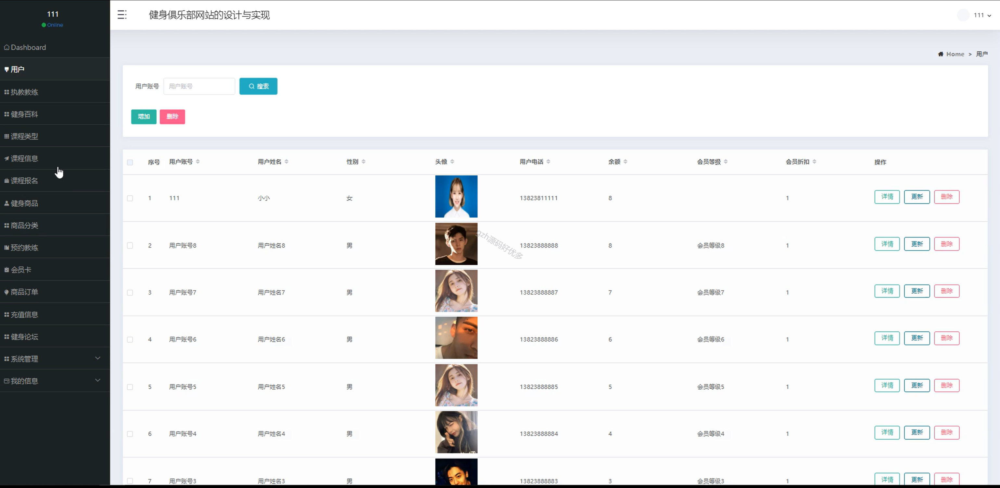

# springbootA353
springbootA353健身俱乐部网站LW
 
## 查看主页获取源码

### 一、作品包含

源码+数据库+设计文档万字+全套环境和工具资源+部署教程

### 二、项目技术

前端技术：Html、Css、Js、Vue2.0、Element-ui

数据库：MySQL

后端技术：Java、Spring Boot、MyBatis

  

### 三、运行环境

开发工具：IDEA/eclipse

数据库：MySQL5.7（最低要5.7版本）

数据库管理工具：Navicat10以上版本

环境配置软件： JDK1.8+Maven3.6.3

前端Nodejs：14

### 四、项目介绍
项目编号：springbootA353

随着人们健康意识的增强和生活水平的提高，健身俱乐部作为健身运动的重要场所，受到了越来越多人的关注和喜爱。然而，传统的健身俱乐部管理方式存在着一些问题，如信息管理不便、会员服务不足等。因此，借助现代化的网络技术，设计一款高效便捷的健身俱乐部网站系统对于提升健身俱乐部的管理水平和会员服务质量具有重要意义。本系统基于Spring Boot框架，实现业务逻辑和数据管理。系统主要功能包括会员管理、课程预订、健身商品售卖等。通过系统，会员可以方便地查看健身课程信息、预订课程、管理个人健身计划等，而管理人员可以高效地管理会员信息、发布课程信息、统计健身数据等，从而提升了俱乐部的管理效率和服务质量。

### 五、运行截图

  
